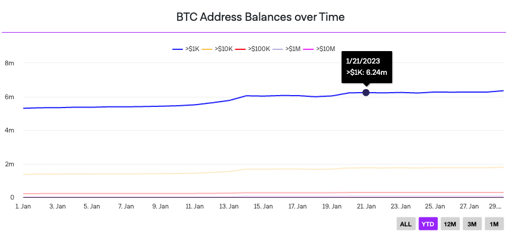
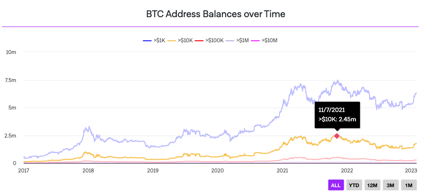

## BTC Address Balance Chart Challenge

You have 5 hours to complete as much of this task as possible. We value quality over feature-completeness. The goal of this code sample is to help us identify what you consider **production-ready** code that is **well maintainable**. (tested, bug-free, clean, error handled, with easy to read naming conventions and a thorough file structure)

It's ok to leave things aside **provided you call them out in your project's README**.

You should consider this code ready for final review from a colleague, i.e. this would be the last step before deploying to production.

We respectfully ask that you do not share this challenge or your solution publicly.

### Create an area or line chart that displays an all-time historic view on btc address balances.

Draw 5 lines in different colors displaying balances
- over $1k
- over $10k
- over $100k
- over $1M
- over $10M

Display a legend that labels each line color.

See "Example Implementation" to get an idea of how the chart should look like.
An ideal implementation would include all features you can see in the example.

### Implementation Notes:

* Use a charting engine you feel most comfortable with
* Use the static data provided (`data/Coin_Metrics_Network_Data_2023-02-02T14-32.csv`) to build an API method
(`pages/api/btc-addresses`)
  * Format the CSV and return JSON timeseries for your charting engine
  * Call the API to load the data inside of your react component
  * Note: The CSV file is now outdated and won't provide any data after 02/2023 but you could compare your implementation with our example screenshot by changing your system clock to February 23.
* Make the chart look nice and clean (either by utilizing the example as a design template or give it your personal UI touch)

## Bonus Points

* Add buttons and filter functionality to filter the chart by YTD, 12M, 3M and 1M.
* Improve performance by leveraging server side rendering

## Example Implementation

