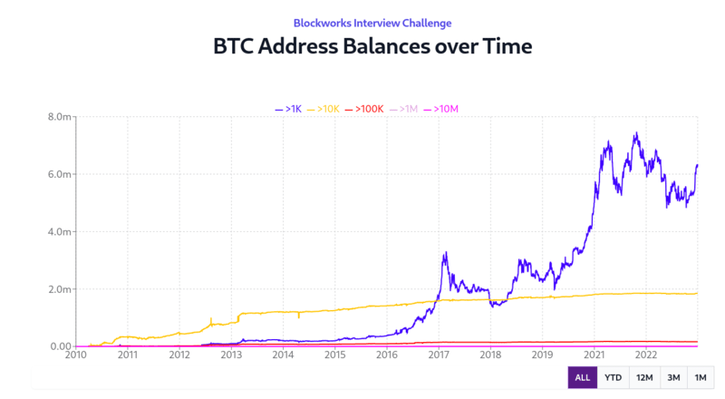

# BTC Address Balance Chart Challenge



## Online Demo

[Vercel Demo](https://blockworks-btc.vercel.app/)

## Table of Contents

- [Technologies Used](#technologies-used)
- [Features](#features)
- [Installation](#installation)
- [Usage](#usage)
- [Project Structure](#project-structure)
- [Performance](#performance)
- [Assumptions](#assumptions)
- [Considerations](#considerations)

## Technologies Used

The project is built using the following technologies:

- React: JavaScript library for building the user interface. (Included)
- Recharts: A popular charting library for rendering interactive charts.
- Next.js: A React framework for server-rendered applications. (Included)
- PapaParse: A CSV parsing library for converting CSV data into JSON.
- Date-fns: A date utility library for handling date manipulation. (Included)
- Tailwind CSS: A utility-first CSS framework for styling the application. (Included)

## Features

- Displays line chart of BTC address balances in requested ranges.
- Filter the chart data by Year-to-Date (YTD), 12 months (12M), 3 months (3M), and 1 month (1M). [ChartRange](types/chartRange.type.ts)
- Various test cases for utilities functions and snapshot testing for commonly reused React Components [[1]](components/**tests**) [[2]](utils/**tests**)

## Installation

1. Download and unpack repo:

   ```bash
   cd react-nextjs-btc-address-chart
   ```

2. Install the dependencies:

   ```bash
   pnpm install
   ```

3. Start the development server:

   ```bash
   pnpm run dev
   ```

## Usage

- Access the application in your web browser at http://localhost:3000
- Explore the BTC address balance chart with filter options.
- Hover over the interactive chart visualization.

## Project Structure

The project structure is organized as follows:

- **app/**: Next.js pages for rendering the web application.
  - **api/**: API route for serving BTC address data from the CSV file.
- **components/**: React components for building the chart and user interface.
- **public/**: Static assets and data. (Includes the provided csv file)
- **styles/**: Styling using Tailwind CSS.
- **utils/**: Utility functions for parsing data and date formatting.
- **\*\*/\_\_tests\_\_/:** Test cases for automated Jest testing.

## Performance

- Server-side rendering (SSR) is used to enhance performance. For this project I decided to migrate from the Page Router to the App Router as it is server-centric while client-side render is opt-in.
- The chart is loaded with server-generated data. As the [api/btc-wallets](app/api/btc-wallets/route.ts) route is cached it will only be required to invoke the expensive csv parsing logic once.

- Filters are calculated on the client-side just once and stored in [walletChartCache](utils/walletUtil.ts#L6). Sequential requests from the same filter will be retrieved from the cache in `O(1)` time.

- Filter calculations have a time complexity of `O(log n)`. Due to the csvData being sorted by default we can utilize Binary Search in function [findIndexOfMax](utils/walletUtil.ts#L32)

## Assumptions

While comparing my output to the provided screenshots I realized some major differences. On closer examination I believe the csv headers provided decent context (`"BTC / Addr Cnt of Bal ≥ $1K"`) to divide based on the wallet balances. Typically I would refer to the data sources' API documentation on how such data was derived rather than assuming. Since it at least visually looks correct after fixing it I hope this is the implementation you are expecting for the challenge. The correction is done on the server-side under [updatedCsvDataList](app/api/btc-wallets/route.ts#L29)

## Considerations

Due to time constraints and prioritization of maximizing feature completeness and test coverage certain ideas were considered but not implemented for the following reasons:

- For large datasets it is common to use algos to downsample it to improve rendering while minimizing any loss data. In this scenerio I would have considered [LTTB](https://github.com/sveinn-steinarsson/flot-downsample)

- I attempted to simplify the filter testing by using `dotenv` and assigning `process.env.MOCK_TODAY_DATE = "2023-02-01"` mock [TODAY](utils/walletUtil.ts#L8)'s date. On testing I realized that I set the server-side clock but not my browsers. If I was able to completed render all the charts and filters on the server then maybe this could be reconsidered.

- Depending on use-case. If chart interactivity were not as important (ie: Chart screenshots for news articles on mobile), I would have liked to create routes for each filter and rendered them on the server-side during build. For example `api/btc/wallets/[filter]`. Unless the chart was streaming live data, this would be very helpful for daily snapshots for news articles.

- Normally I would also include supertesting the api endpoint. Since the GET endpoint does not accept any params and the data is retrieved from a static source at this time, it felt overkill to generate multiple mock CSV documents to test a hypothetical situation where I would be pulling from a database where I can control the Time ranges instead.